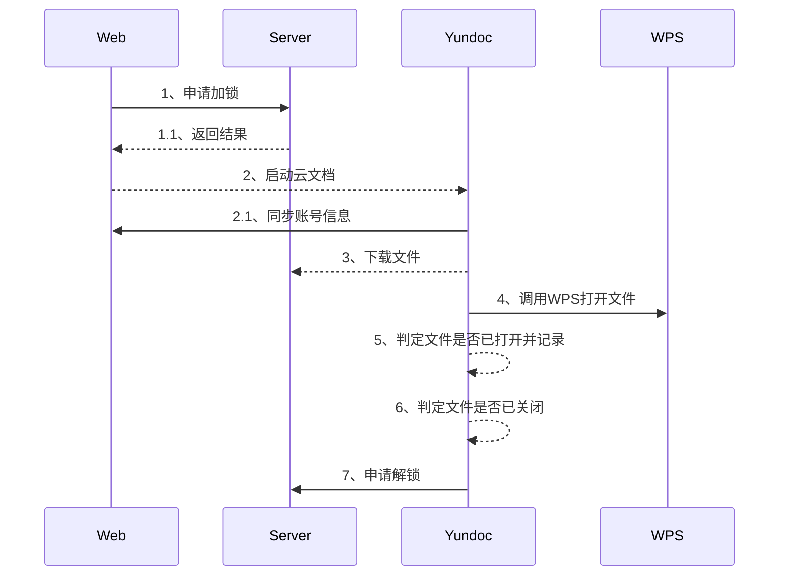

# 文件编辑锁 技术方案

## 修订记录

|   内容   | 修 订 人 |   日期   |
|   :-:     | :-:     | :-:      |
|  初稿    |    桑旋  |2018-07-16|

- [文件编辑锁 技术方案](#%E6%96%87%E4%BB%B6%E7%BC%96%E8%BE%91%E9%94%81-%E6%8A%80%E6%9C%AF%E6%96%B9%E6%A1%88)
  - [修订记录](#%E4%BF%AE%E8%AE%A2%E8%AE%B0%E5%BD%95)
  - [需求背景](#%E9%9C%80%E6%B1%82%E8%83%8C%E6%99%AF)
  - [实现原理](#%E5%AE%9E%E7%8E%B0%E5%8E%9F%E7%90%86)
  - [各模块分工](#%E5%90%84%E6%A8%A1%E5%9D%97%E5%88%86%E5%B7%A5)
    - [cooper功能限制](#cooper%E5%8A%9F%E8%83%BD%E9%99%90%E5%88%B6)
    - [editinglock主要功能流程](#editinglock%E4%B8%BB%E8%A6%81%E5%8A%9F%E8%83%BD%E6%B5%81%E7%A8%8B)
      - [申请加锁](#%E7%94%B3%E8%AF%B7%E5%8A%A0%E9%94%81)
      - [申请解锁](#%E7%94%B3%E8%AF%B7%E8%A7%A3%E9%94%81)
    - [云文档客户端核心流程](#%E4%BA%91%E6%96%87%E6%A1%A3%E5%AE%A2%E6%88%B7%E7%AB%AF%E6%A0%B8%E5%BF%83%E6%B5%81%E7%A8%8B)
      - [文档同步至本地](#%E6%96%87%E6%A1%A3%E5%90%8C%E6%AD%A5%E8%87%B3%E6%9C%AC%E5%9C%B0)
  - [数据设计](#%E6%95%B0%E6%8D%AE%E8%AE%BE%E8%AE%A1)
  - [API 设计](#api-%E8%AE%BE%E8%AE%A1)
  - [开发分支](#%E5%BC%80%E5%8F%91%E5%88%86%E6%94%AF)
  - [任务规划](#%E4%BB%BB%E5%8A%A1%E8%A7%84%E5%88%92)
  - [注意事项](#%E6%B3%A8%E6%84%8F%E4%BA%8B%E9%A1%B9)
  - [相关链接](#%E7%9B%B8%E5%85%B3%E9%93%BE%E6%8E%A5)
  
## 需求背景

如果是直接的产品需求，附上产品需求文档。如果是性能优化，则把性能优化原因写上。

- 列出需求要点，特别是实现中要覆盖的，方便核对是否没有考虑到；
- 列出非功能性的要求；

## 实现原理

- 新增服务editinglock 提供对文件编辑锁的增、删、改、查、批量查询等
- cooper中涉及对文件锁相关操作如：修改目录名称、删除目录、修改文件名、删除文件、移动文件、权限变更等操作需要查询相关目录或者文件是否存在编辑锁
- cooper中新增接口提供editinglock调用，主要涉及用户是否具有文件编辑权限(该部分可视情况是否添加)
- 云文档客户端根据文件状态捕获文件打开、关闭状态，并进行申请加锁、申请解锁
- 云文档客户端在同步文件时根据文件加锁的实时状态进行判定是否触发另存流程

## 各模块分工

- editinglock 主要提供对锁的状态维护
- cooper主要提供对现有功能根据锁状态进行限制
- web在点击编辑时，自动申请加锁，以及新增由于加锁状态而导致操作失败的提示
- 云文档客户端负责识别文件开始编辑、结束编辑，并进行申请加锁、申请解锁，异常情况下实现文件另存
- 以下为在线编辑交互图:



- 云文档客户端编辑见下 云文档客户端核心流程

### cooper功能限制

- 目录相关操作添加判断目录下是否存在锁定的文件
- 文件锁定状态下禁止重名、移动、删除

### editinglock主要功能流程

#### 申请加锁

- 申请加锁需要确定用户是否有编辑权限，防止越权用户将文件全部加锁
- 在线编辑或者云文档客户端下载后用户主动进行编辑
- 申请加锁流程：

```flow
st=>start: 申请加锁
e=>end: 返回结果
cond=>condition: 是否有编辑权限?
cond1=>condition: 存在锁记录?
cond2=>condition: 锁超时?
op1=>operation: 添加锁记录
op2=>operation: 删除锁记录
st->cond
cond(no)->e
cond(yes)->cond1
cond1(yes)->cond2
cond1(no)->op1->e
cond2(yes)->op2->op1->e
cond2(no)->e
```

#### 申请解锁

- 团队拥有者、超时、锁拥有者等可进行解锁操作
  
申请解锁处理流程：

```flow
st=>start: 申请解锁
e=>end: 返回结果
cond1=>condition: 存在锁记录?
cond2=>condition: 锁超时?
cond3=>condition: 拥有者/团队拥有者?
op1=>operation: 删除锁记录
st->cond1
cond1(yes)->cond2
cond1(no)->e
cond2(yes)->op1->e
cond2(no)->cond3
cond3(yes)->op1->e
cond3(no)->e
```

### 云文档客户端核心流程

#### 文档同步至本地

- 文档自动同步至本地
- 同步本地后获取实时获取文件锁定状态，将锁定文件设置为read-only 状态

## 数据设计

[数据库设计]( ../../数据库设计/editinglocak/编辑锁数据库.md )

## API 设计

另写一个API文档放到API列表目录下，并链接到这里

按照Restful API设计规范设计接口，将接口、参数、返回值都写上。必要的返回码释义、错误码和错误码释义。

API 规范：TODO 待补充

请参考模板：
[api接口模版](./接口设计/api接口模版.md)

## 开发分支

TODO 开发分支、部署环境待确认

## 任务规划

时间计划，列出开始时间、提测时间等等。

## 注意事项

- 如果涉及到数据迁移，请写明数据迁移的操作方法，最好是能直接操作的命令步骤。
- 如果涉及环境参数问题，请写明参数含义、如何区分配置。
- 如果有特殊的部署需求，请写明部署方法。

## 相关链接

如果有依赖于其他的接口，最好附上对应的技术文档链接。
